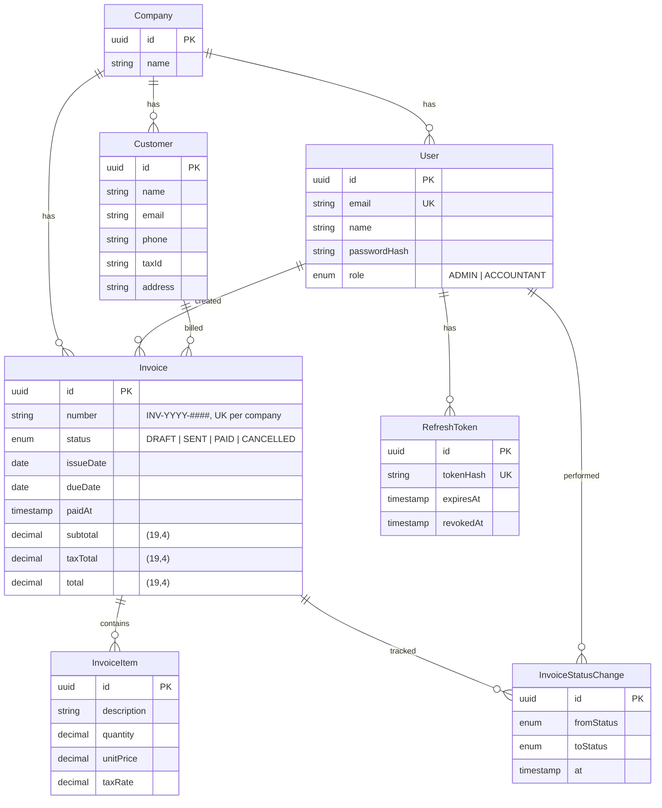

# SLM ERP — Mini ERP Invoicing System

A full-stack invoicing system built as a take-home technical test: manage customers, create invoices, move them through their lifecycle, and watch the money on a dashboard.

**Live demo:** _add your deployed links here once deployed (see [Deployment](#deployment))._


## Tech stack

| Layer     | Choice                                        |
| --------- | --------------------------------------------- |
| Backend   | NestJS 11 (modular monolith, Nest monorepo mode) |
| Database  | PostgreSQL 16 · Prisma 7 (driver adapter)     |
| Frontend  | Next.js 16 (App Router) · React 19 · TailwindCSS 4 |
| UI        | shadcn-style component library in `@repo/ui`  |
| Data layer| React Query · react-hook-form + zod           |
| Auth      | JWT access + rotating refresh · argon2id      |
| Monorepo  | pnpm workspaces · Turborepo                   |

## Prerequisites

- **Node.js ≥ 22.12** (`.nvmrc` pinned to 22)
- **pnpm** (`corepack enable`)
- **Docker** (for the local PostgreSQL container)

## Running locally

```bash
cp .env.example .env    # local defaults already match docker compose
pnpm install
pnpm dev
```

`pnpm dev` boots PostgreSQL, applies migrations, seeds demo data (idempotent — safe to re-run), and starts both apps:

- Web app: http://localhost:3000 (if 3000 is busy, Next.js bumps to 3001 — add your port to `CORS_ORIGIN` in `.env`; the shipped default allows both)
- API + Swagger docs: http://localhost:4000/api/docs

### Seeded credentials

| Role       | Email                    | Password        |
| ---------- | ------------------------ | --------------- |
| Admin      | `admin@slm.local`        | `admin123`      |
| Accountant | `accountant@slm.local`   | `accountant123` |

The accountant demonstrates authorization: user management and deletes return `403`.

### Useful scripts

```bash
pnpm build        # build all packages
pnpm lint         # eslint incl. package-boundary enforcement
pnpm typecheck    # tsc across all packages
pnpm test         # backend unit tests
pnpm --filter @repo/api test:e2e   # auth e2e (uses slm_erp_test database)
pnpm --filter @repo/prisma db:studio
```

## Project structure

```
├── apps/
│   ├── api/            NestJS application (auth, users, customers, invoices, dashboard, health)
│   └── web/            Next.js App Router application
├── libs/
│   ├── prisma/         Prisma schema, migrations, seed, PrismaService (shared kernel)
│   └── common/         NestJS shared kernel: guards, decorators, pagination, money math
├── packages/
│   ├── contracts/      @repo/contracts — shared types + enums (single source of truth)
│   ├── ui/             @repo/ui — reusable component library
│   └── eslint-config, typescript-config
└── nest-cli.json       Nest monorepo workspace config
```

## Database schema (ERD)



The committed Prisma schema (`libs/prisma/prisma/schema.prisma`) is the source of truth.

## API

Interactive Swagger documentation is served at `/api/docs` (bearer auth, example payloads, try-it-now with the seeded admin credentials above). The API is versioned under `/api/v1`:

- `POST /auth/login` · `POST /auth/refresh` · `POST /auth/logout` · `GET /auth/me`
- `GET/POST/PATCH/DELETE /users` (ADMIN only)
- `GET/POST/GET:id/PATCH:D/ DELETE /customers` (delete ADMIN only)
- `GET/POST /invoices`, `GET:PATCH:/DELETE /invoices/:id`, and lifecycle actions `POST /invoices/:id/send`, `/mark-paid`, `/cancel`
- `GET /dashboard/summary`
- `GET /health`

Conventions: offset pagination (`page`, `pageSize` ≤ 100) with a `{ items, page, pageSize, total, totalPages }` envelope; uniform error envelope `{ error: { code, message, details } }`; `409` for illegal status transitions.

## Architectural decisions & assumptions

- **Modular monolith ready for extraction.** Backend modules are bounded contexts (auth, customers, invoices, dashboard); the Nest monorepo layout (`apps/` + `libs/`) means a future service is `nest generate app` + move a module, reusing the same libs. The frontend's vertical route slices and the shared `@repo/ui` package are the future micro-frontend boundaries. `eslint-plugin-boundaries` enforces the package topology as a lint gate.
- **Invoice lifecycle.** `DRAFT → SENT → PAID`, plus `CANCELLED`; `OVERDUE` is derived (SENT past due date), never stored. Drafts are fully editable; once sent, invoices are frozen and the `INV-YYYY-####` number is assigned (per company, per year). Every transition is audited in `InvoiceStatusChange` and shown on the detail view.
- **Auth.** JWT access tokens (15 min) with rotating refresh tokens, hashed at rest and revoked on logout. Tokens are sent as Bearer headers; the frontend keeps the access token in memory and the refresh token in `sessionStorage`.
- **Data fetching.** All authenticated reads use React Query in client components (a consequence of in-memory Bearer tokens — Server Components can't see them). Mutations are REST calls to the API; no Server Actions, keeping business logic in exactly one place.
- **Demo data on deploy.** The release pipeline runs `prisma migrate deploy` and the idempotent seed, so the live demo always opens on populated data.

## Deployment

- **Frontend**: Vercel (connects to the repo; auto-deploys `main`).
- **API**: Render, Docker deployment using `apps/api/Dockerfile` (entrypoint runs migrations + seed on release).
- **Database**: Neon (Postgres 16), free tier.

Environment variables live in each platform's dashboard — never in the repo:

| Variable             | Used by    |
| -------------------- | ---------- |
| `DATABASE_URL`       | API (Neon pooled connection string) |
| `JWT_ACCESS_SECRET`  | API        |
| `JWT_REFRESH_SECRET` | API        |
| `CORS_ORIGIN`        | API (the Vercel app URL) |
| `PORT`               | API        |
| `NEXT_PUBLIC_API_URL`| Web        |

